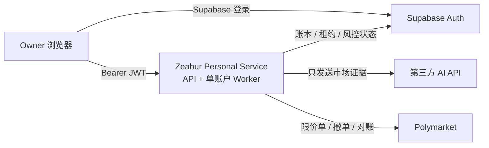

# Poly FlyDAO

面向个人自托管的 Polymarket AI 辅助交易系统。推荐部署只需要三个服务：

- `apps/web/`：Vercel 控制台，只保存公开配置并使用 Supabase Auth 登录；
- `backend/`：一个 Zeabur `personal` 服务，同时运行 FastAPI 和单账户自动周期；
- `backend/supabase/migrations/`：Supabase 中的订单、风险、租约、控制与审计账本。

AI API Key、AI Base URL、模型 ID 和 EVM 私钥只配置在 Zeabur 环境变量中。浏览器不再输入、保存或传输这些秘密，也不需要为“保存密钥”绑定 MFA、RSA envelope、指纹 key 或独立 payload key。



## 最短部署路径

1. 在 Supabase 创建唯一 owner 用户，复制其 Auth User UUID，并关闭公开注册。
2. 按编号应用 `backend/supabase/migrations/` 中全部迁移。
3. 在 Zeabur 以 `backend` 为 Root Directory 创建一个服务，复制 [`backend/deploy/personal.env.example`](backend/deploy/personal.env.example)，设置 `SERVICE_ROLE=personal`。
4. 在 Vercel 以 `apps/web` 为 Root Directory 部署，只配置 `NEXT_PUBLIC_API_BASE_URL`、`NEXT_PUBLIC_SUPABASE_URL` 和 `NEXT_PUBLIC_SUPABASE_PUBLISHABLE_KEY`。
5. 保持 `POLYBOT_MODE=paper` 完成连通性和 Paper 验证，再决定是否承担真实资金风险。

完整步骤见 [部署手册](docs/DEPLOYMENT.md)，信任边界见 [安全说明](docs/SECURITY.md)。

## 真实资金边界

个人模式仍保留数据库订单账本、Worker 租约、控制版本、地理限制、确定性仓位/亏损限制、对账和限价执行。Canary/Live 必须同时显式设置：

```dotenv
POLYBOT_PERSONAL_LIVE_ENABLED=true
POLYBOT_MODE=canary
```

`live` 也必须显式填写；不能由 UI 或 AI 暗中切换。默认 `paper` 不发送真实订单。

本项目不保证高胜率、盈利或持续正收益。AI 输出是有噪声的研究输入；费用后期望值、概率校准、成交率、最大回撤、尾部风险和样本外稳定性比宣传中的历史收益更重要。

## 本地验证

```powershell
Set-Location backend
uv sync --frozen --extra dev
uv run --frozen --extra dev ruff check .
uv run --frozen --extra dev python -m pytest

Set-Location ..\apps\web
npm ci
npm test
npm run build
```

## 数据归档与审计

- `polybot archive --once`：只读归档全量 L2 订单簿与市场元数据到 Supabase，为未来回测提供 point-in-time 数据；服务模式下默认每 300 秒自动执行。
- 每次交易周期自动写入权益历史与 AI 调用台账（token/延迟/估算成本），可在控制台净值曲线与性能页查看。
- 大厂级代码审计提示词见 [`docs/AUDIT_PROMPT.md`](docs/AUDIT_PROMPT.md)，历轮审计报告见 `docs/audit/`。

原有 `api + tenant_queue worker` 多租户部署路径仍保留，供后续 SaaS 化使用；个人部署不需要它。
