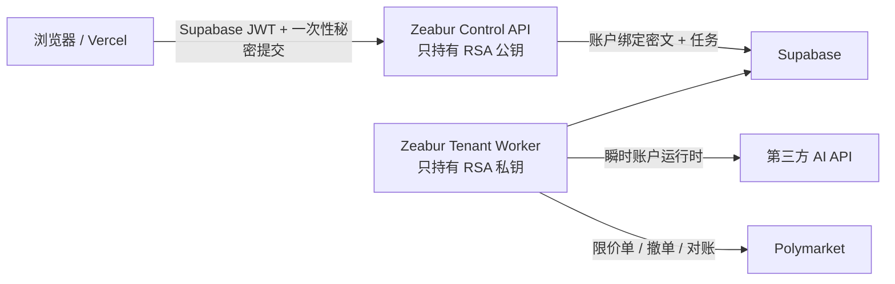

# Poly FlyDAO

面向 Polymarket 的 AI 辅助、多租户、风险受控自动化交易系统。仓库包含：

- `apps/web/`：Vercel Next.js 控制台，Supabase Auth、会话恢复、TOTP MFA、新手向导、部署诊断、AI 判断解释、凭证/钱包配置、任务与资产状态。
- `backend/`：Zeabur FastAPI Control API 与私有 Tenant Worker。
- `backend/supabase/migrations/`：账户隔离、任务租约、风险快照、订单账本和配对策略持久层。
- `docs/`：部署、安全和策略验证门槛。

## 安全架构



API、Worker 与账户任务彼此隔离；真实下单前会在数据库中原子检查任务租约、账户 Worker 租约、短时 arm、控制版本、运行配置、风险快照、钱包和凭证状态。任何一项变化都会拒绝提交。

## 当前交付边界

P0–P1 的认证、凭证隔离、队列执行、钱包生命周期、自动周期、资产展示和 fail-closed 控制面已经接通。P2 的“全限价 + YES/NO 配对成本小于 1 + 有界方向覆盖”已作为研究流水线实现，并包含非原子双腿恢复与事件级 L2 回放；它默认关闭且只允许 research/paper，不会绕过验证门槛进入实盘。

本项目不保证“高胜率”或持续盈利。胜率也不是充分指标；费用后期望值、概率校准、最大回撤、成交率、尾部单腿风险和样本外稳定性更重要。

## 快速验证

```powershell
Set-Location backend
uv sync --frozen --extra dev
uv run --frozen --extra dev ruff check .
uv run --frozen --extra dev python -m pytest

Set-Location ..\apps\web
npm ci
npm test
npm run build
```

部署前先阅读 [部署手册](docs/DEPLOYMENT.md)、[安全说明](docs/SECURITY.md) 与 [策略验证门槛](docs/STRATEGY_VALIDATION.md)。
