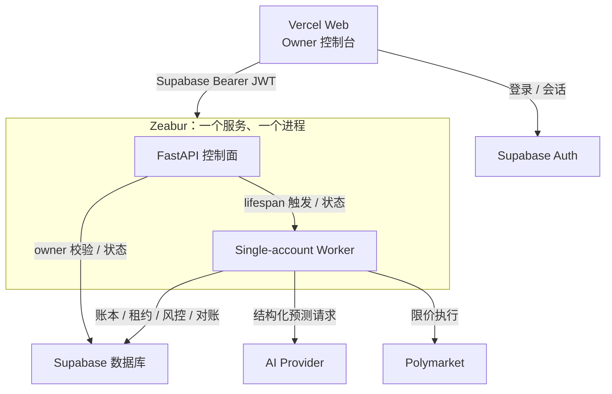
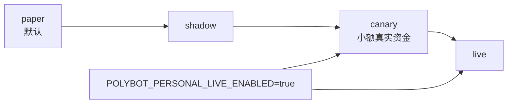

# 架构：个人单账户模式

## 推荐拓扑

`SERVICE_ROLE=personal` 将 API 和一个单账户 Worker 放入同一 Uvicorn 进程，适合个人自托管。`WEB_CONCURRENCY=1` 与单副本是这一部署形态的组成部分，不应为追求吞吐量擅自增加。

## 配置来源

个人模式以 Zeabur 环境变量作为运行配置的唯一秘密来源：

- AI：`POLYBOT_AI_API_KEY`、`POLYBOT_AI_BASE_URL`、`POLYBOT_AI_MODEL`；
- 钱包：`POLYMARKET_PRIVATE_KEY`，可选 `POLYMARKET_DEPOSIT_WALLET`；
- owner：`POLYBOT_ACCOUNT_ID`；
- 模式：`POLYBOT_MODE`、`POLYBOT_PERSONAL_LIVE_ENABLED`；
- 风险与资金：`POLYBOT_BANKROLL_USD`、单笔/敞口/亏损/回撤参数。

前端只读取脱敏状态，例如 provider、model、钱包地址和“已配置/未配置”；不会返回 Key 或私钥。删除/轮换秘密必须在 Zeabur 完成并重新部署。

## 身份和账户范围

Supabase Auth 仍是控制台门锁，但产品不再开放多租户注册。FastAPI 验证 JWT 后，只接受 `sub == POLYBOT_ACCOUNT_ID` 的 owner 会话。浏览器不能通过请求参数切换账户。

因为秘密从不经过前端，个人模式不要求 TOTP/AAL2 来“保存 Key”，也不需要 RSA-OAEP credential envelope、credential fingerprint 或独立 worker keyring。这是易用性改造，不代表取消登录或公开 API 的 owner 校验。

## 自动周期与持久状态

FastAPI lifespan 启动内嵌 Worker。自动周期按配置间隔执行，前端也可以触发一次即时周期。Supabase 保存：

- 运行控制、模式与配置绑定版本；
- Worker 租约和 fencing token；
- Paper 状态、预测、证据、交易意图、订单、成交与持仓；
- 风险快照、对账状态、通知与审计记录；
- 个人钱包公开地址、余额/allowance 就绪状态和检查时间，不保存环境变量中的明文私钥。

重启服务不应把已经提交或结果不确定的订单当作全新订单重发。无法确认数据库、租约或对账状态时停止新订单。

## Paper、Shadow、Canary、Live

- `paper`：模拟成交，不发送真实订单；
- `shadow`：使用真实盘口评估但不提交订单；
- `canary`：小额真实资金，单笔有硬上限；
- `live`：真实资金，仍受全部确定性风险闸门限制。

Canary/Live 必须同时满足部署级 `POLYBOT_PERSONAL_LIVE_ENABLED=true` 与显式模式。个人模式的最新数据库迁移为环境钱包建立专用提交闸门；它不会复用需要 tenant credential row 的旧 SaaS 路径。

## AI 的权限

AI 只产出结构化概率、置信区间、论据、反方证据和有限方向信号。以下决定仍由确定性代码控制：

- 市场是否可交易、token 身份和结算规则；
- 价格、深度、费用、最小订单、限价/post-only/GTD；
- Kelly、单笔、事件、桶、总敞口、日亏损和回撤；
- 钱包余额、allowance、租约、模式授权和地理限制；
- 签名、发送、撤单、重试与对账。

模型输出被视为不可信输入。AI API 不会收到 EVM 私钥，也不能直接调用 Broker。

## 真实订单提交闸门

在 `signed → submitting` 的数据库事务中，个人模式至少再次检查：

- 订单属于 owner 和当前配置绑定；
- Worker lease/fencing token 仍有效；
- runtime control 的模式、版本和取消状态未变化；
- 部署已显式允许个人真实资金模式；
- 钱包公开地址与当前配置绑定一致；
- collateral 余额与 allowance 就绪记录足够新；
- 风险、地理、盘口和对账状态可用；
- 订单仍是可提交的幂等状态。

数据库事务与外部 CLOB POST 不能组成分布式原子事务，因此系统仍需 GTD 到期、模糊结果不盲重发、cancel-all、unresolved 状态和持续对账。它降低风险，但不能保证绝对没有孤儿订单。

## P2 策略边界

全限价、分时收集 YES/NO、总成本低于 1、方向覆盖和 L2 replay 已作为研究流水线存在。P2 仍由代码与数据库双重标记为 research-only；启用个人 Canary/Live 不会自动把研究策略接入真实执行。

历史账户盈利、胜率截图或社交媒体传闻只能形成研究假设，不能证明当前费用后优势、可复制性或未来盈利。

## 高级/旧多租户模式

仓库仍保留 `Control API + Tenant Worker` 两服务、账户队列、RSA envelope、租户凭证/钱包生命周期和原子 tenant submission gate。它适用于未来 SaaS 化，但会增加部署和密钥管理复杂度，不是个人模式默认路径。
