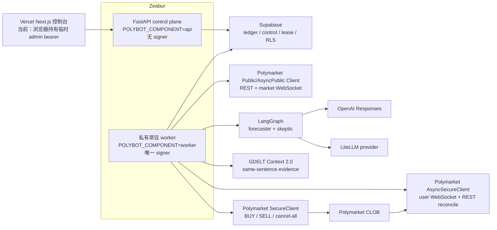
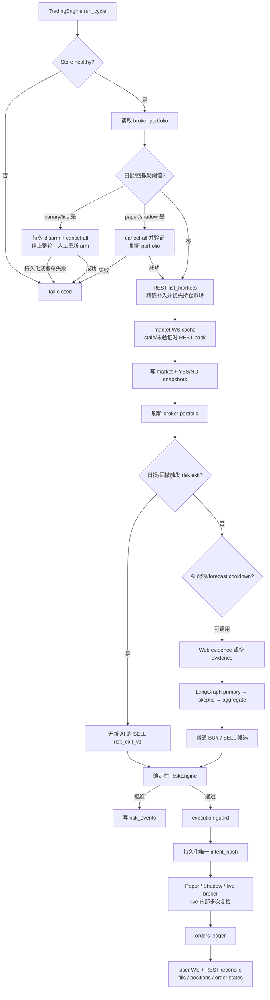

# Polybot 架构、实现状态与边界

本文描述 `polybot 0.1.0` 当前代码，不把目标架构写成已经完成的能力。

状态定义：

- **已实现**：代码路径存在，并有本地单元/契约形状测试覆盖；
- **部分实现**：主路径存在，但仍缺真实环境验证、恢复路径或生产控制；
- **未实现**：只有 schema、依赖或设计说明，不能作为上线能力；
- **未验证**：即使代码已存在，也没有用真实资金和官方生产环境完成小额 canary。

> Polybot 不保证高胜率。当前仓库只能用于 paper-first 的研发和受控验证；没有真实小额 canary 和样本外校准结果，就不能声称策略有可持续优势。

## 1. 当前拓扑

推荐生产部署使用两个组件：

| 组件 | 配置 | 当前职责 | 不应持有 |
|---|---|---|---|
| 控制 API | `SERVICE_ROLE=api`、`POLYBOT_COMPONENT=api` | status、paper/shadow 手动 cycle、短时 arm/disarm、Store readiness | 钱包私钥、deposit wallet、签名 payload key |
| 执行 worker | `SERVICE_ROLE=worker`、`POLYBOT_COMPONENT=worker` | 市场扫描、AI、风险、lease、签名、广播、对账、cancel-all | admin bearer；也不应公开域名 |

`POLYBOT_COMPONENT=api` 在 canary/live 使用 `ControlPlaneBroker`，不会创建 `SecureClient`。`POLYBOT_COMPONENT=worker` 才需要 signer secrets；worker 也会拒绝以 `component=api` 启动。

`component=all` 保留给本地/兼容运行。真实资金部署不应让公开 API 使用它，因为这会重新把控制面和 signer 放进同一进程。

当前 dashboard 仍直接从浏览器向 FastAPI 发送 admin bearer。Supabase Auth、MFA、server-side proxy、CSRF/Origin 强校验和 mutation rate limit 尚未实现，因此 UI 只是运维原型。

## 2. 一次决策周期

执行顺序的重要性质：

1. 市场发现和 AI 之前先检查组合硬阈值；日损或回撤超限时先撤清旧挂单并验证，再刷新仓位，只处理持仓市场的无 AI 退出。
2. AI 只生成概率区间、置信度和论据；仓位、限价、费用、风险上限由普通代码计算。
3. 每个市场异常只跳过该市场；Store 或执行 guard 异常会 fail closed。
4. 风控通过后，engine 在 reserve intent 前检查 execution guard；live broker 随后独立复检 unresolved orders、control、reconciliation、lease/fencing 和 book age，直到 POST 边界。这样 guard 关闭不会把已经持久化的 intent 留成没有 execution 记录的孤儿。
5. `intent_hash` 不包含随机 run ID；它包含 account、mode、market、token、side、price、size、strategy、forecast ID 和可选 decision key。普通预测订单在同一 forecast 内稳定去重；硬退出使用分钟级、含持仓量的 decision key，允许后续周期继续分批退出。

## 3. 市场数据：WebSocket + REST

### 已实现

- 市场发现通过官方 `PublicClient.list_markets` REST paginator，并按服务端实际接受的数值 JSON 字段 `liquidityNum` 降序；避免把字符串 `liquidity` 做字典序排序；
- `StreamingPolymarketMarketData` 订阅官方 market WebSocket；
- full book、price change、tick-size change、market-resolved 事件更新内存 cache；
- cache 缺失、超过 `POLYBOT_MAX_BOOK_AGE_SECONDS`，或超过 30 秒未做 REST 校验时，调用 REST `get_order_book`；
- WebSocket 异常使用指数 backoff 重连，REST 继续作为恢复路径；
- 每个周期把实际使用的 YES/NO book 保存到 Supabase snapshots。

### 部分实现/缺口

- 没有显式 WebSocket heartbeat 时间戳或 sequence-gap 检测；
- market stream 没有独立 `healthy` gate；安全性主要依赖 book age 和 REST fallback；
- snapshots 不是 YES/NO 原子配对，也没有完整增量事件日志；
- Store 的 snapshot `source` 仍使用 `clob_rest:<token>` 标签，即使内容可能来自已验证的 WS cache，来源标记需要后续细化。

## 4. AI、证据与 LangGraph

### 已实现

- OpenAI Responses Web Search 证据收集；结构化 URL 必须存在于实际 citation/tool source metadata，外部文本按不可信数据处理并截断；
- OpenAI Responses Structured Outputs 解析为 Pydantic `ForecastPayload`；
- LiteLLM `acompletion` + strict JSON Schema 的替代 provider；
- LiteLLM 的 `auto` evidence 使用 keyless GDELT Context 2.0；一个第三方 AI key 即可运行 forecast，并在近 72 小时存在同句 snippet 时形成 URL 证据链；
- LangGraph 固定顺序：独立 primary、看不到 primary 结果的 skeptic、确定性聚合；
- 最终概率取均值，区间取并集，模型分歧降低置信度；
- 每周期最多调用 `POLYBOT_MAX_AI_MARKETS_PER_CYCLE` 个市场；
- Supabase 中的 forecast cooldown 防止短时间重复调用；
- canary/live 至少需要两个独立可注册发布域名（eTLD+1）的 URL evidence，forecast 也必须实际引用达到阈值的 URL-backed evidence ID；
- OpenAI/LiteLLM provider 使用有界的单次请求 timeout；失败也会消耗当轮 AI 市场配额，避免故障时横向放大调用；
- OpenAI/LiteLLM 都有输出 token 上限。

### 部分实现/缺口

- LangGraph 没有持久化 checkpointer、跨周期 memory、人工中断或恢复节点；
- [GDELT Context 2.0](https://blog.gdeltproject.org/announcing-the-gdelt-context-2-0-api/) 只把查询词同句命中的 `sentence/context` snippet 作为可计数证据；市场 resolution source 与无 snippet 的标题线索保留为元数据但不计数。Context 当前只覆盖近 72 小时，可能限流或缺失，失败时会跳过而不是让模型自造链接；
- 有独立域名/引用硬门，但尚未对所有 source 实现正文抓取校验、统一发布日期时效或权威域名 allowlist；
- 没有整个 evidence + 双模型图的总 deadline、货币成本 ledger、多供应商自动 fallback 或漂移告警；
- 没有基于真实已结算市场的校准器、calibration version 回写或在线 Brier 监控；
- 当前 forecast `input_hash` 用于审计/去重字段，但不是完整可复现的模型请求快照。

## 5. BUY、SELL 与风险退出

### 普通 BUY

BUY 使用：

- YES 的 `probability_low` 或 NO 的 `1 - probability_high`；
- 实际 asks 的深度 sweep 与 VWAP；
- SDK 市场元数据中的动态 fee rate/exponent；
- uncertainty reserve；
- 1/4 Kelly、现金、单笔、事件、相关 bucket 和总敞口上限；
- 最低流动性、最低 edge、最小订单、盘口时效和距结算时间。

### 普通 SELL

如果已有仓位，且实际 bids 的可成交价格扣除费用和不确定性准备金后高于保守概率上界，策略可以生成 SELL。SELL 会检查可用 token 数量、bid 深度、最小订单和限价，不会卖空。

### 硬 risk exit

当 `min(fill realized PnL, 当前权益 - UTC 日初权益)` 达到日损上限，或 equity 相对持久化 peak 的回撤达到上限：

- canary/live 会先持久化 disarm/kill latch，再调用并验证 `cancel_all`，停止整轮；跨 UTC 日也不会自动恢复，必须人工审阅后重新 arm；
- paper/shadow 才运行 `choose_risk_exit`：先撤单并刷新仓位，再生成无 AI 的受限 SELL；
- 取消后刷新仓位，并按 position 的 `condition_id` 补入热门扫描遗漏的持仓市场；
- 不需要 forecast；
- 允许越过普通最小 edge 和最低流动性门；
- 仍需要市场可交易、book 新鲜、有持仓、有 bid、满足最小订单；
- 每次仍受 `max_order_usd` 限制，因此大仓位可能分多个周期退出。

### 当前组合精度

Live portfolio 已读取：

- 当前 positions；
- open orders，并为 BUY 预占现金/敞口、为 SELL 预留 token；
- collateral balance；
- 提交前按 BUY collateral 或 SELL conditional token 再检查 balance 和 allowance；
- condition→event 归一化后的 event exposure；无法映射的挂单敞口会计入每个候选事件上限；
- 从完整 bot fills 历史按平均成本重建、以 UTC 日界切分的 realized PnL；
- Supabase `account_risk_state` 中持久化的 UTC 日初、latest 和 peak equity；
- 从 epoch 0 冷启动重放账户成交，`size_threshold=0` 拉取 dust，并在开放 SELL 预留前比较 fill/activity ledger 与实时 token 数量；
- `REDEEM` activity 关闭整个 condition 的剩余成本，SPLIT/MERGE/CONVERSION 直接阻断专用钱包。

仍有边界：

- correlated bucket 无可靠的跨市场主题映射；当前 live 未分类敞口按保守总量处理；
- positions、open orders 与余额仍来自官方账户 API；realized PnL 来自本地 fills ledger，两侧由 user WS + REST reconcile 连接；
- 专用钱包出现无法映射到 durable bot order 的账户成交、外部 token 仓位或未支持 activity 时，对账会 fail closed；系统不猜测旧钱包成本；
- paper broker 以成本估值，重启不会从 Supabase rehydrate。

## 6. Live 单次提交与模糊结果

只有安装了 worker lease guard 的 `PolymarketBroker` 可以广播。单次提交顺序为：

1. 读取 runtime control，要求 mode 一致、armed、`accept_new_intents`、kill switch 与 `cancellation_pending` 为 false、未过期；
2. 验证 worker lease/reconciler，取得 fencing token；
3. 调用官方 geoblock；canary/live 配置只允许官方端点；
4. 复核订单 cap、当前 book、exchange balance 和 allowance；
5. 调用 SDK `create_limit_order`，只签名一次；
6. 序列化 exact signed payload，计算 hash，用 Fernet 加密；
7. 在 POST 前把 ciphertext、hash、key version 和 fencing token 写入 `orders`，状态为 `signed`；
8. 再验证 fencing token 和 control version；
9. `mark_order_submitting` 在单条 SQL 中验证 order fencing token 与当前未过期 lease，再原子更新为 `submitting`；
10. 最终复检 fencing token、control version 和 book age；
11. 单次调用 `post_order`；
12. CLOB 接受只记为 `submitted`，不能当成 filled；后续状态由对账推进。

### 模糊广播的 fail-closed 行为

如果 `post_order` timeout 或抛出无法判断是否已接收的异常：

- 不重新签名；
- 不自动重发；
- 请求 `cancel_all`，并通过重复读取 open orders 验证；
- 保留已持久化的 `signed/submitting/unknown` 状态；
- `has_unresolved_live_orders` 会阻止 worker 后续创建订单，直到人工/对账处理。

这关闭了“超时后再签一单”的重复订单路径，但没有自动解决所有模糊订单。当前也没有按 signed hash 自动向 CLOB 查询和恢复的完整状态机。

## 7. Worker lease 与 fencing

### 已实现

- worker 生成唯一 owner ID；
- 周期调用 Supabase `claim_worker_lease`；
- 新 owner 接管过期租约时 fencing token 递增；
- worker 保存 token，并在每次签名前调用 `validate_worker_lease`；
- signed order 记录 `worker_fencing_token`；
- `signed → submitting` 的数据库 RPC 原子验证当前未过期 token，之后、POST 前再做一次最终验证；
- lease 丢失、续约异常、reconciler unhealthy、Store unhealthy 或 shutdown 时请求并验证 `cancel_all`；
- shutdown 先持久化 disarm/cancellation latch，重复撤单并核验，再确认 latch；只有上述步骤与最终 lease 复验都成功才释放 lease，否则保留至自然过期交接；
- stale token 行为有 MemoryStore 单元测试。

### 仍是部分 fencing

Fencing 已覆盖“谁可以签名和广播”这一资金边界，但还没有让 orders、fills、positions、risk events 的每一次数据库状态转换都带 fencing-token 条件。它显著缩小 split-brain 窗口，但不能被描述为完整的全 ledger fencing。

一个 worker replica 仍是部署要求；lease 不是横向扩容机制。

## 8. 账户和订单对账

### 已实现

`OrderReconciler` 在 canary/live worker 中：

- 启动时先做 REST reconciliation，再订阅认证 user WebSocket；
- 每次冷启动从 epoch 0 读取完整 authenticated trades；成功后才使用带 60 秒重叠的 watermark；
- 周期读取 open orders、trades、lifecycle activities 和 `size_threshold=0` positions；
- trade watermark 重叠 60 秒，幂等重放迟到状态；
- maker trade 拆分到对应 maker order，taker trade 映射到 taker order；
- fills 以稳定 `fill_key` upsert；
- 推进 `MATCHED / MINED / CONFIRMED / RETRYING / FAILED`；
- Accepted response 中的 `trade_ids` 与所有非终态 trade 会独立轮询到 `CONFIRMED/FAILED`，不只依赖 matched-at 游标；
- open-order snapshot 中消失的 durable bot 订单会逐 ID `get_order`；非 404 错误 fail closed，404 后先从 epoch 0 修复完整成交历史，再持久化缺失次数；只有连续两次确认（或明确 cancel-pending）才终态化；
- positions snapshot 会把不再活跃的旧 token 归零；
- positions 与 fills + REDEEM activity 重放数量不一致时不设置 healthy；
- 首次写 position 前按 condition 精确补存对应 market，避免新库已有持仓时的启动对账死锁；
- 初始 REST 成功且 user stream 已订阅后才设置 `healthy`；周期 REST 失败会清除它。

### 缺口

- 没有 user-stream heartbeat、sequence/gap 检测；
- 不会自动重建无法映射到 durable bot order 的外部/orphan trade；专用钱包遇到这种账户成交会 fail closed；
- 没有 CLOB order ID 的 `signed/submitting/unknown` 仍需人工确认；
- 没有 Polymarket order heartbeat；
- cancel-all 能验证当前 open-order 集合为空，但没有逐订单取消事件的完整恢复工作流。

## 9. API 与 runtime control

FastAPI 当前提供：

- `GET /livez`：进程 liveness；
- `GET /health`：Store readiness 与进程 mode；
- `GET /v1/status`：admin bearer 保护的 control 和风险参数；
- `POST /v1/cycles/run`：admin bearer 保护，只允许 paper/shadow；
- `POST /v1/control/arm`：canary/live、mode 一致、Supabase、1–15 分钟；
- `POST /v1/control/disarm`：设置 kill switch 和清除 arm。

Signer-free API 无法直接调用 exchange cancel-all，因此 disarm 响应会标明 `cancellation_pending_worker=true`。该字段是数据库持久锁存，不依赖 worker 恰好看到某个中间版本；worker 验证零开放订单后以 control-version CAS 清除它。锁存未清除时 `arm_runtime_control` RPC 拒绝重新 arm。

当前认证只是静态 admin bearer。Supabase Auth、MFA、服务端用户身份、CSRF、请求 nonce/idempotency 和用户归属审计尚未完成。

`accept_new_intents` 已进入 `RuntimeControl.is_live_armed`、API arm/disarm payload 和数据库结构约束；它与 armed、kill switch、expiry、mode、control version、lease/reconcile 和 broker 复检共同组成 live gate。

## 10. Supabase ledger

| 表 | 当前状态 |
|---|---|
| `markets` | 已接线，按 condition/Gamma ID 维护映射 |
| `snapshots` | 已接线，保存周期实际使用的 book |
| `evidence` | 已接线，按 content hash upsert |
| `forecasts` | 已接线；尚无真实结算后的 calibration 回写 |
| `risk_events` | 已接线；通过和拒绝均记录 |
| `order_intents` | 已接线，`intent_hash` 全局 unique |
| `orders` | 已接线，包含 signed ciphertext/hash、fencing token 和状态 |
| `fills` | 已接线，由 user WS/REST trades 幂等推进 |
| `account_activities` | 已接线，保存 REDEEM/SPLIT/MERGE/CONVERSION；只有 REDEEM 可进入成本重放 |
| `positions` | 已接线，由 REST positions snapshot upsert/归零 |
| `runtime_controls` | 已接线，短时 arm CAS、持久化撤单锁存、version trigger、系统 audit |
| `worker_leases` | 已接线，claim/validate/release 和 fencing token |
| `account_risk_state` | 已接线，原子持久化 UTC 日初、peak/latest equity |
| `audit_events` | 部分接线；control trigger、orphan/disappeared reconcile 已记录，尚非所有运维动作都有用户归属审计 |

RLS、authenticated 只读授权和 service-role 写边界由 migration 建立。`orders.signed_payload_ciphertext`、response payload 和 fill raw payload 不授予 dashboard 的 authenticated SELECT。

Paper/shadow 即使使用 Supabase，也只持久化决策、意图和 simulated order；PaperBroker 的现金、fills、positions 和 realized PnL 仍在进程内，重启会重置。

## 11. 四种运行模式

| 模式 | 订单行为 | 当前适用范围 |
|---|---|---|
| `paper` | 深度感知的内存 BUY/SELL partial fill | 默认、本地、CI、策略开发 |
| `shadow` | 跑完整决策链并记录意图，永不下单 | 真实数据/模型观测 |
| `canary` | 官方 SDK 真单，单笔硬上限 5 pUSD | 代码路径已具备，但尚未完成真实小额验收 |
| `live` | 与 canary 相同但使用配置上限 | 当前不批准扩大资金 |

进程 mode 在启动时固定；数据库不能把 paper 进程动态变成 live。API 和 worker 的 canary/live mode 必须一致。

## 12. 自动赎回

`POLYBOT_AUTO_REDEEM_RESOLVED` 默认 `false`。

显式启用后，只有 leased worker 在短时 arm 和 geoblock 都有效时才会：

- 查询 `redeemable=True` positions；
- 每周期最多处理 5 个唯一 condition；
- 调用 `redeem_positions` 并等待 SDK handle。

赎回成功会立即刷新权益；REST 对账把 REDEEM 写入 activity ledger，成本重放关闭该 condition 的所有剩余 token。它仍缺真实资金 canary 和专门 incident recovery，首个真实资金版本应保持关闭。

## 13. Prefect、回测与 Nautilus

- `flows.py` 只有一个 `retries=0` 的 `trading_cycle_flow`；
- 它没有 worker lease/fencing guard，只适用于 paper/shadow 的人工或离线周期；
- 常驻执行由 `polybot.worker` 承担，不由 Prefect 调度；
- JSONL 回测器计算 Brier、log loss、PnL、ROI、胜率和最大回撤；
- 回测器不模拟完整 event engine、订单排队、WS 时序、撤单或链上结算；
- NautilusTrader 只是 `research` optional dependency；当前只有规范化 order-book JSONL 导出函数和 runtime 探测，没有 Nautilus adapter、Parquet exporter、runner 或结果 importer。

因此不能把 Prefect 全流程编排或 Nautilus 高保真重放写成已交付能力。

## 14. 实盘前仍未完成

以下仍是扩大真实资金前的阻塞项：

1. 在合法地区用专用低余额钱包完成真实小额 canary，覆盖 BUY、SELL、部分成交、cancel、timeout、reconnect 和结算；
2. 建立 point-in-time 历史数据集、walk-forward 校准集和真实结算评分，验证样本外净期望值；
3. 增加 market/user WebSocket heartbeat、sequence-gap 检测和重连后的显式健康证明；
4. 接入并验证 Polymarket order heartbeat；
5. 建立 signed hash、closed orders 和 orphan trades 的完整 unknown 恢复状态机；
6. 把 fencing token 变成所有资金相关数据库转换的条件；
7. 把 critical portfolio-risk/cancel 事件和更可验证的数据流健康完整写入持久审计；
8. 完成 dashboard Supabase Auth、MFA、server-side proxy、Origin/CSRF、rate limit 和用户审计；
9. 完成 paper ledger rehydrate 与 crash consistency；
10. 在已有单次请求 timeout 和证据数量/引用门之上，建立整个 AI 图 deadline、成本 ledger、fallback、来源验证、校准和漂移监控；
11. 用小额验证自动赎回 activity ledger、独立授权、审计和恢复；未验证前保持关闭；
12. 运行真实 Supabase/RLS、Zeabur rolling deploy 和官方 SDK 的集成测试。

只有这些条件闭环并通过预定义 Gate，才可以讨论 bounded live；仍然不能承诺高胜率。
