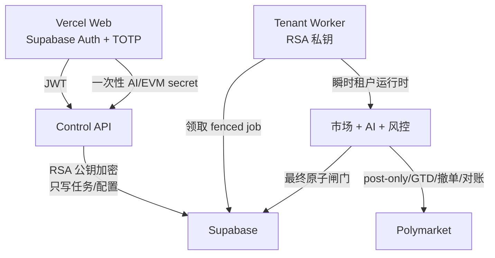

# 架构与 P0–P2 状态

## 组件边界

- Vercel 只持有公开 URL、Supabase publishable key 和短期用户会话。
- Control API 验证 Supabase RS256/ES256 JWT，以 `sub` 作为唯一账户范围。它不能解密凭证或签名订单。
- Tenant Worker 持有 RSA 私钥与签名 payload key。每个任务创建一个账户绑定 Store 和瞬时 Runtime。
- Supabase service role 绕过 RLS，因此所有后端 Store 都再次做不可变账户绑定；跨账户参数在查询前被拒绝。

## P0：控制面和秘密边界

已实现：

- Supabase 注册、登录、回调、退出、会话恢复和受保护路由。
- 缺少 Supabase 配置时惰性创建客户端，Vercel 预渲染不再因空 URL 失败。
- 公开 `/diagnostics` 仅返回三端连通性布尔状态；登录后的 `/setup` 给出下一步，
  `/analysis` 展示账户隔离的概率、反方证据、失效条件与来源。
- 生产漏配 API/Auth 不回退 localhost。
- TOTP MFA；敏感凭证、钱包和真实资金控制要求 AAL2。
- AI key 与 EVM key 一次性提交；API 用 RSA-OAEP-256 + AES-256-GCM 账户绑定加密。
- API/Worker 密钥分离、日志脱敏、验证错误不反射输入。
- 旧 `X-*` secret headers 被拒绝，旧 localStorage secret 整体清除。

## P1：多租户自动执行

已实现：

- 账户运行配置、不可变风险快照、自动周期和幂等任务队列。
- `FOR UPDATE SKIP LOCKED` 任务领取、heartbeat、租约回收、每账户并发限制。
- Worker 每次从任务快照加载 AI、钱包、模型、模式和风险限制。
- 钱包导入采用异步生命周期：派生地址、展示入金信息、资金到位后授权、撤销前 cancel-all + 零挂单验证。
- API 只排队，不同步运行交易，也不构建 signer。
- 真实下单使用账户 Worker lease、任务 lease、短时 arm、控制 watcher、对账健康和订单幂等。
- 最后一个数据库事务同时验证任务、账户租约、控制版本、运行配置、风险版本、钱包和两类凭证，再允许 `signed → submitting`。
- disarm、租约丢失、对账失败或周期边界触发撤单和 fail-closed。

## P2：微结构配对研究

已实现但默认关闭：

- 严格识别 BTC/ETH 等短周期 Up/Down 市场，不靠问题文字猜测 token 方向。
- 两边只挂 maker 限价；计算 YES + NO 完整成本、费用、对冲费用缓冲、单腿风险和资金成本。
- 只有费用后配对成本严格低于结算价值才生成计划。
- 双腿不是原子成交：状态机处理部分接受、部分成交、撤单竞态、确定性有界对冲和冻结。
- 配对仓位与方向性多余仓位分账；方向覆盖有独立上限，不能把单腿风险伪装成套利。
- Supabase 原子 plan/CAS/fill RPC、幂等成交、append-only inventory event 和对账回调。
- 事件级 L2 replay 模拟队列前方深度、部分成交、提交/撤单延迟和 cancel race。

P2 的 `research_only` 是代码与数据库双重门，不连接 live runtime。传闻账户的历史利润只能形成假设，不能证明可复制、费用后正 EV 或适合当前市场。

## AI 的权限

AI 只产出结构化概率、置信区间、论据和有限方向信号。以下决定始终由确定性代码控制：

- 市场是否可交易、token 身份和结算规则；
- 价格、深度、费用、最小订单和 post-only；
- Kelly/单笔/事件/桶/总敞口、日亏损和回撤；
- 钱包余额、allowance、arm、租约和地理限制；
- 签名、发送、撤单和对账。

第三方模型输出被视为不可信输入，不能读取钱包私钥，也不能直接调用 Broker。

## 仍需外部验证

- 0007–0014 在真实 PostgreSQL/Supabase 上的完整 migration reset。
- Polymarket 生产环境的小额 wallet approval、post-only/GTD、user stream 和模糊响应恢复。
- 长期 point-in-time 数据、样本外概率校准、shadow 成交偏差和 live canary。
- 生产监控、告警、备份恢复、密钥轮换演练和人工事件响应。
